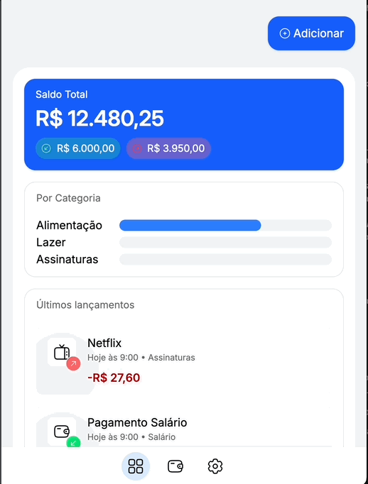

# 💰 FinUp

O **FinUp** é um sistema de gerenciamento de finanças pessoais em desenvolvimento, criado com o objetivo de explorar boas práticas de **construção de componentes do zero**, além de documentar **complexidade técnica, acessibilidade e usabilidade** de cada parte da aplicação.

Atualmente o projeto contém um **dashboard mockado** e um **modal de adicionar despesas/receitas**, sem ações conectadas, apenas para demonstrar o funcionamento inicial dos componentes.

<p align="center">
  
  
</p>

---

## 🚀 Objetivo do Projeto

- Criar uma aplicação de finanças pessoais **do zero**.
- Documentar o processo de desenvolvimento de cada **componente** e **funcionalidade**.
- Explorar temas como **arquitetura**, **acessibilidade** e **usabilidade**.
- Usar o projeto como **portfólio** e base para estudos.

---

## 🏗️ Status Atual

✔ Dashboard mockado  
✔ Modal de adicionar despesa/receita (ainda sem ação)  
⬜ Carteira com meios de pagamentos mockado  
⬜ Conexão com dados reais  
⬜ Cadastro de transações  
⬜ Relatórios e gráficos

---

## 📦 Componentes Atuais

- **Dashboard** (layout mockado de resumo financeiro).
- **Modal de Adicionar Transação** (interface inicial para adicionar despesa/receita).

> Cada componente terá documentação detalhada em posts separados.

---

## 📝 Documentação e Posts

Este repositório servirá também como base para uma **série de artigos**, explicando:

- Como cada componente foi construído.
- As decisões de design, arquitetura e acessibilidade.
- As funcionalidades e melhorias ao longo do tempo.

📌 Posts planejados:

1. **Introdução ao FinUp** – objetivo, stack e visão geral.
2. **Criando o Dashboard inicial** – estruturação e primeiras decisões de UI.
3. **Modal de Adicionar Transação** – primeiros passos na interação.
4. Próximos componentes: Inputs, Botões, Listagem de Transações, etc.

---

## 🖥️ Como rodar o projeto

```bash
git clone https://github.com/wueliton/finup.git
cd finup
npm install
npm run dev
```
